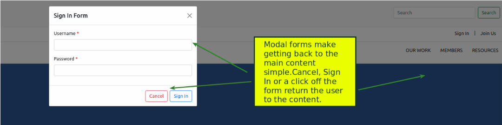
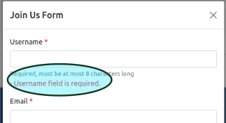
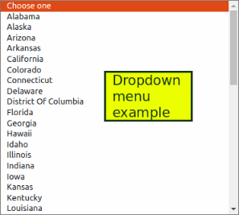

<h1 align="center"><strong>IFT 598 Project Report</strong></h1>
<p align="center"> A Project Report presented to the instructors of IFT 598 Middleware Programming and Database Security</p><br>
<p align="center">By</p><br>
<p align="center"><em>Hooman Mishaeil - Group 28</em></p>
<p align="center"><em>IFT 598 Session C, Summer 2021</em></p>
<p align="center"><em>hmishaei@asu.edu</em></p><br>
<p align="center"><em>Jeffrey Ashworth - Group 28</em></p>
<p align="center"><em>IFT 598 Session C, Summer 2021</em></p>
<p align="center"><em>jdashwo2@asu.edu </em></p><br>
  
- [<strong>Introduction    </strong>](#introduction----)
- [<strong>Description</strong>](#description)
  - [<strong>Structure</strong>](#structure)
    - [<strong>Navigation Design</strong>](#navigation-design)
      - [<em>Prevent Mistakes:</em>](#prevent-mistakes)
      - [<em>Use Consistent Grammar Order</em>](#use-consistent-grammar-order)
      - [<em> Menus are Broad and Shallow </em>](#-menus-are-broad-and-shallow-)
    - [<strong>Input Design and Validation</strong>](#input-design-and-validation)
      - [<em>Minimize Keystrokes</em>](#minimize-keystrokes)
      - [<em>Input Validation</em>](#input-validation)
      - [<em>Login and Registration</em>](#login-and-registration)
  - [<strong> Creative Logo</strong>](#-creative-logo)
  - [<strong> Aesthetic</strong>](#-aesthetic)
  - [<strong> Consistency</strong>](#-consistency)
  - [<strong> Browser Compatibility</strong>](#-browser-compatibility)
  - [<strong> Use of 3 of 4 HTML5 Features</strong>](#-use-of-3-of-4-html5-features)
    - [<em> SVG For Respsonsive Web</em>](#-svg-for-respsonsive-web)
    - [<em>Audio & Video Embedded</em>](#audio--video-embedded)
    - [<em> Geolocation</em>](#-geolocation)
    - [<em> Drag and Drop</em>](#-drag-and-drop)
  - [<em> Use javascript for client-side validation of registration and logon pages</em>](#-use-javascript-for-client-side-validation-of-registration-and-logon-pages)
- [User Manual](#user-manual)
- [Conclusion](#conclusion)

# <strong>Introduction    </strong>
  <p>The IFT 598 "Middleware Programming and Database Security" project team was charged with completing "Deliverable 1"; a user interface (UI) that must include a validated registration and login page as well as several other required design and technical elements detailed later in this report.  The team chose to use the course provided wireframe and volunteer organization concept to build their deliverable submission.  The team implemented a responsive UI using HTML5, JavaScript, JQuery 3.3.1, and Bootstrap 5.01.  The JQuery and Bootstrap libraries are accessed via Content Delivery Networks (CDN) in lieu of a local copy.  This provides a lightweight and robust implementation of those library elements to users, regardless of their geographic location. This deliverable is the first in a series of deliverables, building upon one another to complete the course project and was designed and constructed with that in mind.  </p> 
  

# <strong>Description</strong>

## <strong>Structure</strong>

###  <strong>Navigation Design</strong>

#### <em>Prevent Mistakes:</em>

<p>The design and layout of the site lends itself to preventing mistakes with a clear and concise access to content. Menus are labeled clearly and minimize ambiguity.<p align="center"></p>  The forms are modal to prevent a user from clicking away and getting lost.</p><br>

#### <em>Use Consistent Grammar Order</em>

<p>Consistent grammar
The same words, buttons and colors are used throughout the page and forms to prevent confusion and create an easily learned environment for the user.  For example, the Username field is used to describe all text entry fields where a username is expected.  <p align="center"></p>A red button color is consistent for all cancel actions and a blue color is used for all submit functions.
</p><br>

#### <em> Menus are Broad and Shallow </em>

<p>The menu structure is designed to limit the "digging" required by the user and reduce the number of clicks and keystrokes to access the content on the page.<p align="center"></p></p><br>

### <strong>Input Design and Validation</strong>

#### <em>Minimize Keystrokes</em>
  <p>The team used Tab ordering in forms and on pages to eliminate the need for mouse clicks and additional keystrokes. 
  <p align="center"></p></p>

#### <em>Input Validation</em>

<p> Additionally, date pickers and dropdowns are used where possible to eliminate mistakes by the user and ensure data consistency of format.<p align="center"></p></p><br>

#### <em>Login and Registration</em>
In addition to the validation and required fields implementations in the forms, the team also utilized regular expressions to ensure formats are enforced for fields such as the email address.  For example, an incorrect email format missing @ or a .'domain' yields and error </p>  <br>whereas a correct format is accepted by the form. </p><br>

## <strong> Creative Logo</strong>
<p>Although the team used the course provided template, A unique logo was developed to convey the intent of the organization and the content of site.  The logo makes it clear to the user what type of content they can expect on the site.  Additional consideration was taken to use a color palette that adheres to the Web Content Accessibility Guidelines (WCAG) 2.0, that can then be safely carried throughout the site and all its content.</p> <p align="center"></p><br>

## <strong> Aesthetic</strong>
<p>As mentioned in the previous section, a validated color palette was used for contrast and accessibility.  Use of color is minimal and tasteful preventing a busy appearance and leaving the content as the focus of the site.  </p>
<br>

## <strong> Consistency</strong>
<p> As demonstrated in previous sections, the team made deliberate design considerations to provide a comfortable and familiar user experience by using common language, button types, button colors, font types for specific elements and a standard header, content, footer layout.</p><br>

## <strong> Browser Compatibility</strong>
<p>During development and testing, the team utilized the major browsers to determine cross browser functionality.  Additionally, team deliberately used library and element versions known to have broad browser compatibility.  A responsive web experience, including collapsible navigation bars and breakpoints on elements were intentionally integrated to accommodate various browsers, screen sizes and devices. <p align="center"></p></p> <br>

## <strong> Use of 3 of 4 HTML5 Features</strong>

### <em> SVG For Respsonsive Web</em>
  <p>The team decided to create the logo in a Scalable Vector Graphic format.  As the design of the site is responsive, it is important to have a graphics that allow for lossless scalability and responsiveness and seamlessly implements with HTML5.  As the SVG is markup, it is easily edited and when not overly complex, provides for a smaller asset than some other graphic formats.  As demonstrated, the logo is as clear at 50px as it is at 1000px.</p>
  <br>

### <em>Audio & Video Embedded</em>
<p>Using an iframe nested in a column row, the team implemented an embedded video that allows for several flexible user options, including full screen and player controls.<p align="center"></p></p> <br>

### <em> Geolocation</em>

<p>Calling the Web API function for the widely browser compatible, "Navigator.Geolocation.getCurrentPosition() method 

```

    var loc = document.getElementById("location");

    if (navigator.geolocation) {
        navigator.geolocation.getCurrentPosition((position) => {
            loc.innerHTML = "Latitude: " + (position.coords.latitude).toFixed(2) + ", Longitude: " + (position.coords.longitude).toFixed(2);
        });
    } else {
        loc.innerHTML = "Geolocation is not supported by this browser.";
    }  
```

after the page is loaded allows the user to decide if a current location can be obtained by the browser. <p align="center"></p>The team chose to implement this a display of longitude and latitude in a browser nav bar. <p align="center"></p></p> <br>

### <em> Drag and Drop</em>
<p>The team implemented the HTML5 drag and drop functionality by allowing a user to take the IMPACT logo and move it between two boxes as depicted below.<p align="center"></p><p align="center"></p><br>

## <em> Use javascript for client-side validation of registration and logon pages</em>
<p> The team chose to create client side validation functions using JavaScript to ensure input fields such as an email address or password adhere to input rules.  For example, the validation functions for password adherence :

```
      function lowercaseExistsInPassword(password) {
          return (/[a-z]/.test(password))
      }

      function uppercaseExistsInPassword(password) {
          return (/[A-Z]/.test(password))
      }

      function digitExistsInPassword(password) {
          return (/[0-9]/.test(password))
      }

      function passwordIsLongerThanEightCharacters(password) {
          return password.length > 8
      }
```
appears to the user in the form as this:
<p align="center"></p>In addition, a reset capability was implemented to remove the -d-none class of each text-danger class to reset the form of validation error notifications if the form is closed and reopened.</p><br>

# User Manual

# Conclusion


